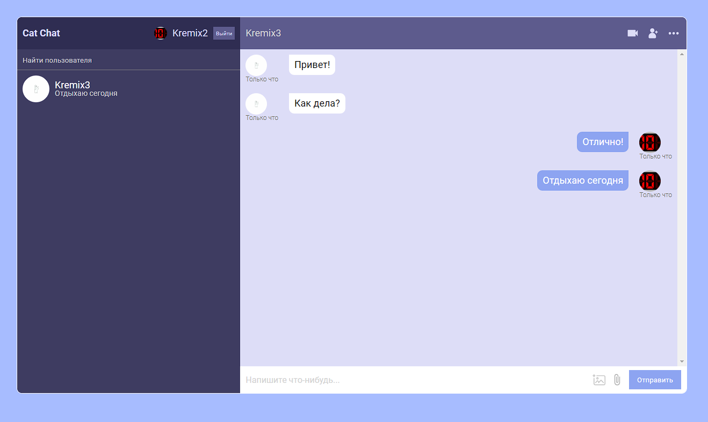

# Чат-сайт с функцией обмена сообщениями real-time

## Расположил сайт на бесплатном хостинге для возможности потыкать
## http://y9225508.beget.tech/

## Стек: 
#### React (хуки, функциональные компоненты, react-router-dom),

#### TypeScript,

#### Firebase,

#### SASS

## Скрины чата:

\
\
\

## Доступные скрипты

В дериктории этого проекто можно запустить:

### `npm start`

Запустить сайт чата

### `npm run build`

Собрать сайт чата